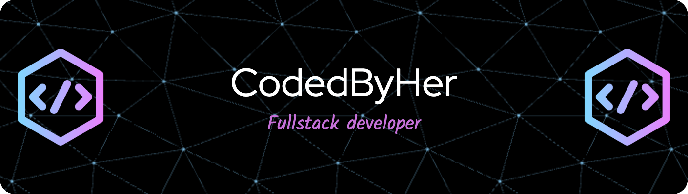

  

<h1 align="center">Hello, World! 👋 I'm Bharti Jayprakash</h1>

  🌟 Passionate software developer turning ideas into impactful solutions with creativity, logic, and dedication.

---

## 🌟 About Me  

Hi there! I’m **Bharti Jayprakash**, a **full-stack developer** and an enthusiastic coder. I specialize in building efficient, scalable, and user-centric applications. Whether it’s creating seamless user experiences or designing robust backend systems, I love every step of the development process.

Here’s a glimpse of what makes me tick:  
- 🎯 **Focused Learner**: I'm constantly upskilling in advanced technologies, especially in web development and backend engineering.  
- 💡 **Creative Thinker**: I enjoy blending logic and creativity to build solutions that look great and work even better.  
- 🤝 **Team Player**: I believe in the power of collaboration and am always open to learning from others.  
- 🌱 **Growth-Oriented**: From mastering new tech stacks to contributing to open-source, my journey is all about continuous improvement.  

---

## 🚀 My Tech Arsenal  

Here’s a detailed breakdown of the tools and technologies I use to bring ideas to life:

### **Programming Languages**  
- 💻 **JavaScript**: My go-to language for full-stack development.  
- 💡 **C++**: Strong foundation in data structures and algorithms.  
- 🐍 **Python**: Versatile scripting and data science projects.  
- ☕ **Java**: Backend applications and object-oriented programming.

---

### **Frontend Development**  
- ⚛️ **React.js**: Building interactive, dynamic user interfaces.  
- 🎨 **Tailwind CSS**: Designing sleek, responsive, and modern web pages.  
- 📜 **HTML5 & CSS3**: Foundation of all my web projects.

---

### **Backend Development**  
- 🛠️ **Node.js**: Developing fast and scalable server-side applications.  
- 🚀 **Express.js**: Crafting RESTful APIs and middleware for smooth server communication.  
- 🗂️ **Mongoose**: Object Data Modeling (ODM) for seamless MongoDB integration.

---

### **Database Management**  
- 🗄️ **MongoDB**: NoSQL database for flexible and efficient data storage.  

---

### **Developer Tools & Platforms**  
- 🛠️ **Git & GitHub**: Version control and code collaboration.  
- 🖥️ **Visual Studio Code**: My preferred code editor for productivity and efficiency.  
- ⚡ **Postman**: API testing and debugging.  

---

  

---

## 🌐 Let’s Connect  

I’d love to hear from you! Whether it’s for collaboration, mentorship, or just a friendly chat, don’t hesitate to reach out.  

- 💼 **LinkedIn**: [Bharti Jayprakash](https://www.linkedin.com/in/bharti-jayprakash-profile/)  
- 🐦 **Twitter**: [@BhartiJayprakash](https://x.com/invtfl_bharti)  
- 📧 **Email**: bharti.jayprakash19@gmail.com  

---

## ⭐️ Support My Work  

If you find my projects helpful or inspiring, please consider giving them a **⭐️ star**. Your support means the world to me and motivates me to keep building amazing things.  

---

✨ Together, let’s code the future! ✨

